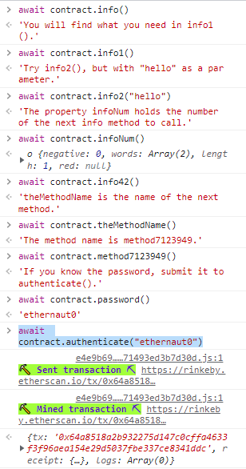
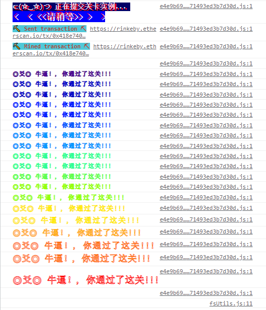

# Hello Ethernaut

> 新手村教程

安装MetaMask，打开chrome的开发者工具的控制台。生成新实例后：0x2bD250F5833128367272B971Aa8e4C83f4EB72DB，根据提示进行打怪。

```js
> await contract.info() 
< 'You will find what you need in info1().'

await contract.info1() 
'Try info2(), but with "hello" as a parameter.'

await contract.info2("hello") 
'The property infoNum holds the number of the next info method to call.'

await contract.infoNum() 
	length: 1
	negative: 0
	red: null
	words: (2) [42, 空白]

await contract.info42()
'theMethodName is the name of the next method.'

await contract.theMethodName()
'The method name is method7123949.'

await contract.method7123949()
'If you know the password, submit it to authenticate().'

await contract.password()
'ethernaut0'

await contract.authenticate("ethernaut0")
```



然后点击提交实例



吐槽：这个配色有点...