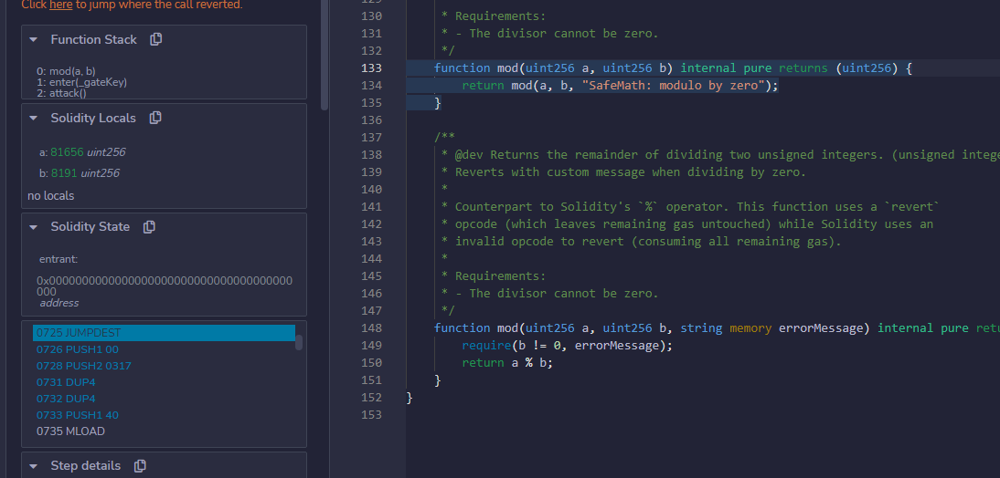

# Gatekeeper One

> 越过守门人并且注册为一个参赛者来完成这一关.

## 源码

```solidity
// SPDX-License-Identifier: MIT
pragma solidity ^0.6.0;

import '@openzeppelin/contracts/math/SafeMath.sol';

contract GatekeeperOne {

  using SafeMath for uint256;
  address public entrant;

  modifier gateOne() {
    require(msg.sender != tx.origin);
    _;
  }

  modifier gateTwo() {
    require(gasleft().mod(8191) == 0);
    _;
  }

  modifier gateThree(bytes8 _gateKey) {
      require(uint32(uint64(_gateKey)) == uint16(uint64(_gateKey)), "GatekeeperOne: invalid gateThree part one");
      require(uint32(uint64(_gateKey)) != uint64(_gateKey), "GatekeeperOne: invalid gateThree part two");
      require(uint32(uint64(_gateKey)) == uint16(tx.origin), "GatekeeperOne: invalid gateThree part three");
    _;
  }

  function enter(bytes8 _gateKey) public gateOne gateTwo gateThree(_gateKey) returns (bool) {
    entrant = tx.origin;
    return true;
  }
}
```

## 攻击思路

- 对于gateOne，用合约进行代理调用即可。

- 对于gateTwo，保证gasleft取到的gas值为8191的整数倍即可，可以在合约调用时调整call时的gas值。

  在本地调用GatekeeperOne ，debug调试，查看mod运算时的gasleft是多少

  

  可以看到mod时，gasleft == 81656，（初始gas == 81910）。所以只需要81910+（81910 - 81656）== 82164

- 对于gateThree，EVM是栈虚拟机，采用大端模式。
  - 对于gateThree part one，保证后4位与后8位转为数字后相同，即为0000abcd。
  - 对于gateThree part two，保证后8位与全16位转为数字后不同，即前8位与后8为不同，即为efgh00000000abcd。
  - 对于gateThree part three，保证账户（tx.origin）的后4位与后8位转为数字后相同，账户后4位为：85d1。即abcd = 85d1（另外：efgh != abcd = 85d1）
  - 综上， _gateKey为 0x33000000000085d1

理论已有，开始实践。

## 攻击代码

```solidity
contract Attack {
    
    GatekeeperOne constant private target = GatekeeperOne(0x341C80357A52Eb142543bBF1F817E92ab29f9Fda);

    function attack() public {
        bytes8 _gateKey = 0x33000000000085d1;
        target.enter{gas:82164}(_gateKey);
    }

}
```

