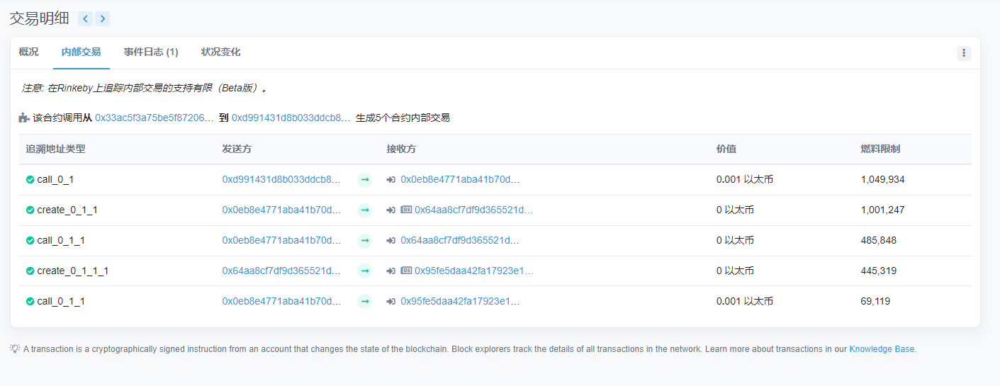

# Recovery

> A contract creator has built a very simple token factory contract. Anyone can create new tokens with ease. After deploying the first token contract, the creator sent `0.001` ether to obtain more tokens. They have since lost the contract address.
>
> This level will be completed if you can recover (or remove) the `0.001` ether from the lost contract address.

## 源码

```solidity
// SPDX-License-Identifier: MIT
pragma solidity ^0.6.0;

import '@openzeppelin/contracts/math/SafeMath.sol';

contract Recovery {

  //generate tokens
  function generateToken(string memory _name, uint256 _initialSupply) public {
    new SimpleToken(_name, msg.sender, _initialSupply);
  
  }
}

contract SimpleToken {

  using SafeMath for uint256;
  // public variables
  string public name;
  mapping (address => uint) public balances;

  // constructor
  constructor(string memory _name, address _creator, uint256 _initialSupply) public {
    name = _name;
    balances[_creator] = _initialSupply;
  }

  // collect ether in return for tokens
  receive() external payable {
    balances[msg.sender] = msg.value.mul(10);
  }

  // allow transfers of tokens
  function transfer(address _to, uint _amount) public { 
    require(balances[msg.sender] >= _amount);
    balances[msg.sender] = balances[msg.sender].sub(_amount);
    balances[_to] = _amount;
  }

  // clean up after ourselves
  function destroy(address payable _to) public {
    selfdestruct(_to);
  }
}
```

## 攻击思路

只要我们找到刚刚创建的SimpleToken的合约地址，然后调用destroy函数，将SimpleToken合约自毁并将eth转移到我的账户地址即可。

### 黑猫

借助区块链浏览器，查找创建实例时的交易，获取创建的SimpleToken合约地址



可以从浏览器得到SimpleToken合约地址为：0x95fe5dAA42fa17923e1f1d2375858a563A5A1C3B

### 白猫

另外，可以查看实例地址：0x64aA8cf7df9d365521d94c6066Ecd5ec8310eE3D的nonce值，查询上一个nonce值所对应的合约地址

```js
// 查询地址的nonce值
// 初始化基本对象
const Web3 = require('web3');
const web3 = new Web3(new Web3.providers.HttpProvider("https://rinkeby.infura.io/v3/4d7440b583e447f7b7d5630b038e0dc7"));
var nonce = web3.eth.getTransactionCount("0x64aA8cf7df9d365521d94c6066Ecd5ec8310eE3D").then((nonce) => {
    console.log(nonce);
    console.log(web3.utils.numberToHex(nonce));
});
```

使用[网站](https://toolkit.abdk.consulting/ethereum#contract-address)，查询该地址上一个nonce值对应的合约地址为：0x95fe5dAA42fa17923e1f1d2375858a563A5A1C3B

或者使用如下代码

```go
package main

import (
	"crypto/ecdsa"
	"fmt"
	"github.com/ethereum/go-ethereum/common"
	"github.com/ethereum/go-ethereum/common/hexutil"
	"github.com/ethereum/go-ethereum/crypto"
	"github.com/ethereum/go-ethereum/rlp"
	"log"
)

func main() {
	addr := common.HexToAddress("0x64aA8cf7df9d365521d94c6066Ecd5ec8310eE3D")
	fmt.Println(CreateAddress(addr, 1))
}

// CreateAddress creates an ethereum address given the bytes and the nonce
func CreateAddress(b common.Address, nonce uint64) common.Address {
	data, _ := rlp.EncodeToBytes([]interface{}{b, nonce})
	return common.BytesToAddress(crypto.Keccak256(data)[12:])
}
```


## 攻击流程

调用0x95fe5dAA42fa17923e1f1d2375858a563A5A1C3B合约的destroy函数，函数参数为我的账户地址。将合约自毁拿回ETH

