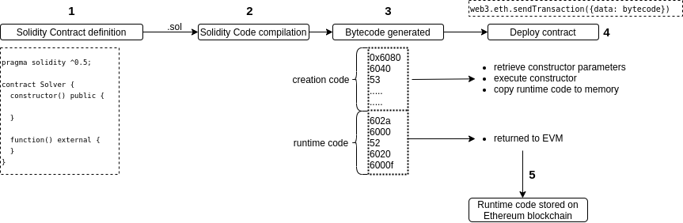

# MagicNumber

> To solve this level, you only need to provide the Ethernaut with a `Solver`, a contract that responds to `whatIsTheMeaningOfLife()` with the right number.
>
> Easy right? Well... there's a catch.
>
> The solver's code needs to be really tiny. Really reaaaaaallly tiny. Like freakin' really really itty-bitty tiny: 10 opcodes at most.
>
> Hint: Perhaps its time to leave the comfort of the Solidity compiler momentarily, and build this one by hand O_o. That's right: Raw EVM bytecode.
>
> Good luck!

## 源码

```solidity
// SPDX-License-Identifier: MIT
pragma solidity ^0.6.0;

contract MagicNum {

  address public solver;

  constructor() public {}

  function setSolver(address _solver) public {
    solver = _solver;
  }

  /*
    ____________/\\\_______/\\\\\\\\\_____        
     __________/\\\\\_____/\\\///////\\\___       
      ________/\\\/\\\____\///______\//\\\__      
       ______/\\\/\/\\\______________/\\\/___     
        ____/\\\/__\/\\\___________/\\\//_____    
         __/\\\\\\\\\\\\\\\\_____/\\\//________   
          _\///////////\\\//____/\\\/___________  
           ___________\/\\\_____/\\\\\\\\\\\\\\\_ 
            ___________\///_____\///////////////__
  */
}
```

## 攻击思路

题目要求我们写一个solver合约，solver合约会对MagicNum合约的whatIsTheMeaningOfLife()合约间调用返回42（0x2a）。但是要求solver合约最多只有10个操作码。

编写合约计算attack合约的codesize

```solidity
contract Help{
  function helper(address _attack) public view returns (uint){
    Attack target = Attack(_attack);
    uint256 size;
    assembly {
      size := extcodesize(target)
    }
    return size;
  }
}
```

## 攻击流程

### 瞎猫

```solidity
contract Attack{
    function whatIsTheMeaningOfLife() public pure returns (bytes32){
        return bytes1(int8(42));
    }
}
```

使用Help计算该合约的codesize = 173。攻击失败。

### 黑猫

题目提示使用EVM操作码进行操作。

```solidity
contract Attack{
  constructor() public {
    assembly {

      // This is the bytecode we want the program to have:
      // 00 PUSH1 2a /* push dec 42 (hex 0x2a) onto the stack */
      // 03 PUSH1  0 /* store 42 at memory position 0 */
      // 05 MSTORE
      // 06 PUSH1 20 /* return 32 bytes in memory */
      // 08 PUSH1 0
      // 10 RETURN
      // Bytecode: 0x604260005260206000f3 (length 0x0a or 10)
      // Bytecode within a 32 byte word:
      // 0x00000000000000000000000000000000000000000000604260005260206000f3 (length 0x20 or 32)
      //                                               ^ (offset 0x16 or 22)
      
      mstore(0, 0x602a60005260206000f3)
      return(0x16, 0x0a)
    }
  }
}
```

部署好Attack合约，调用实例中的setSolver函数，参数为Attack合约地址，然后提交实例。

#### 合约部署到区块链上的流程：

1. 用户或者合约发布一个部署合约交易到区块链上，这笔交易与普通的转账交易不同的是，该交易的to字段为空，即没有交易的接收者。这样来告诉EVM这是一笔合约部署，合约信息存储在msg.data中。
2. evm对solidity的代码进行编译，编译成字节码，该字节码中包含initialization code和runtime code.       
3.  在合约创建过程中，EVM 只执行initialization code。只执行constructor()函数，此时合约的codesize等于0
4. 将runtime code复制到内存中并返回到 EVM。
5. EVM 将返回的runtime code与新的合约地址关联后存储



### 白猫

1. Runtime code

   | # (bytes) | OPCODE   | Stack (left to right = top to bottom) | Meaning                                                      | bytecode |
   | --------- | -------- | ------------------------------------- | ------------------------------------------------------------ | -------- |
   | 00        | PUSH1 2a |                                       | push 2a (hexadecimal) = 42 (decimal) to the stack            | 602a     |
   | 02        | PUSH1 00 | 2a                                    | push 00 to the stack                                         | 6000     |
   | 05        | MSTORE   | 00, 2a                                | `mstore(0, 2a)`, store 2a = 42 at memory position 0          | 52       |
   | 06        | PUSH1 20 |                                       | push 20 (hexadecimal) = 32 (decimal) to the stack (for 32 bytes of data) | 6020     |
   | 08        | PUSH1 00 | 20                                    | push 00 to the stack                                         | 6000     |
   | 10        | RETURN   | 00, 20                                | `return(memory position, number of bytes)`, return 32 bytes stored in memory position 0 | f3       |

The assembly of these 10 bytes of OPCODES results in the following bytecode: `602a60005260206000f3`

1. Creation code We want to excute the following:

   - `mstore(0, 0x602a60005260206000f3)`: store the 10 bytes long bytecode in memory at position 0.
     This will store `602a60005260206000f3` padded with 22 zeroes on the left to form a 32 bytes long bytestring.
   - `return(0x16, 0x0a)`: starting from byte 22, return the 10 bytes long runtime bytecode.

   | # (bytes) | OPCODE                      | Stack (left to right = top to bottom) | Meaning                                            | bytecode               |
   | --------- | --------------------------- | ------------------------------------- | -------------------------------------------------- | ---------------------- |
   | 00        | PUSH10 602a60005260206000f3 |                                       | push the 10 bytes of runtime bytecode to the stack | 69602a60005260206000f3 |
   | 03        | PUSH 00                     | 602a60005260206000f3                  | push 0 to the stack                                | 6000                   |
   | 05        | MSTORE                      | 0, 602a60005260206000f3               | `mstore(0, 0x602a60005260206000f3)`0               | 52                     |
   | 06        | PUSH a                      |                                       | push a = 10 (decimal) to the stack                 | 600a                   |
   | 08        | PUSH 16                     | a                                     | push 16 = 22 (decimal) to the stack                | 6016                   |
   | 10        | RETURN                      | 16, a                                 | `return(0x16, 0x0a)`                               | f3                     |

2. The complete contract creation bytecode is then `69602a60005260206000f3600052600a6016f3`

3. Deploy the contract with `await web3.eth.sendTransaction({from:player,data:"0x600a600c600039600a6000f3602a60805260206080f3"}, function(err,res){console.log(res)})`, which returns a Promise. The deployed contract address is the value of the `contractAddress` property of the object returned when the Promise resolves.

4. Pass the address of the deployed solver contract to the `setSolver` function of the `MagicNumber` contract.

## 参考资料：

[EVM对于内存的操作码](https://github.com/ethereum/go-ethereum/blob/master/core/vm/opcodes.go)

https://github.com/r1oga/ethernaut#level-18---magicnumber

[Ethernaut Lvl 19 MagicNumber Walkthrough: How to deploy contracts using raw assembly opcodes](https://medium.com/coinmonks/ethernaut-lvl-19-magicnumber-walkthrough-how-to-deploy-contracts-using-raw-assembly-opcodes-c50edb0f71a2)

