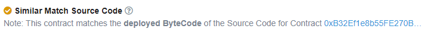
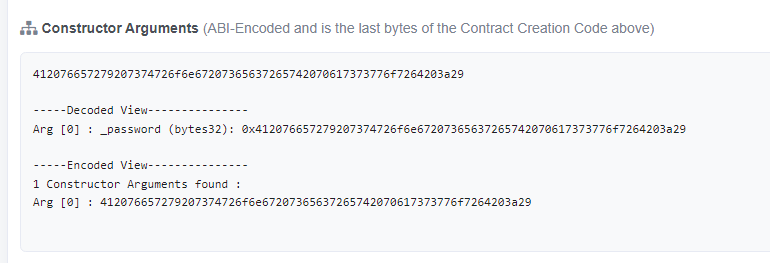
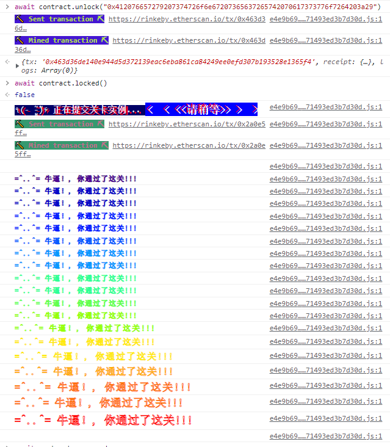

# Vault

> 打开 vault 来通过这一关!


### 源码

```solidity
// SPDX-License-Identifier: MIT
pragma solidity ^0.6.0;

contract Vault {
  bool public locked;
  bytes32 private password;

  constructor(bytes32 _password) public {
    locked = true;
    password = _password;
  }

  function unlock(bytes32 _password) public {
    if (password == _password) {
      locked = false;
    }
  }
}
```

## 攻击思路

### 黑猫

合约无解，但是password作为明文在构造时传入了，只要找到构造合约的交易就能找到password。我在[Etherscan](https://rinkeby.etherscan.io/address/0x4958d0e84c5709afa517772557e478a190cc5996#code)上查看合约时发现提示：



然后我点进提示的地址：0xB32Ef1e8b55FE270Bc665F52076bc677B0D02f8f

发现这个合约与我的实例合约一样，并且这个合约有明文的构造函数



抱着试一试的态度，居然成了。



不过这纯属瞎猫碰到死耗子。不是该题的正确解题思路。


### 白猫

web3.js有函数：getStorageAt

```js
// 获取地址在某个特定位置的存储值。
// 参数
//	String - 用来获取存储值的地址。

//	Number|String|BN|BigNumber - 存储的索引位置。

//	Number|String|BN|BigNumber - (可选) 如果传入值则会覆盖通过 //web3.eth.defaultBlock 设置的默认区块号。预定义的区块号可以使用 "latest","earliest" "pending", 和 "genesis" 等值。

//	Function - (可选) 可选的回调函数，其第一个参数为错误对象，第二个参数为函数运行结果。

// 返回值
//	Promise 返回 String - 给定位置的存储值。

web3.eth.getStorageAt(address, position [, defaultBlock] [, callback])

```


## 攻击代码

根据solidity中变量存储在内存插槽（一个slot有256位，32个字节）中，在被攻击合约中有两个变量：

```solidity
  bool public locked;// boo1占8个字节，一个插槽中可以放32个bool，locked占了插槽0中1个字节，此时插槽0还有31个字节
  bytes32 private password;// bytes32占32个字节，因为插槽0中还有31个字节，不够放password的32个字节，所以password占插槽1
```

```js
//初始化基本对象
const Web3 = require('web3');
const web3 = new Web3(new Web3.providers.HttpProvider("https://rinkeby.infura.io/v3/4d7440b583e447f7b7d5630b038e0dc7"));

web3.eth.getStorageAt("0x0b8D3e77A426537E467F797a46C61F6CF6476790", 1)
.then(console.log);
```


请记住, 将一个变量设制成私有, 只能保证不让别的合约访问他. 设制成私有的状态变量和本地变量, 依旧可以被公开访问.

为了确保数据私有, 需要在上链前加密. 在这种情况下, 密钥绝对不要公开, 否则会被任何想知道的人获得. [zk-SNARKs](https://blog.ethereum.org/2016/12/05/zksnarks-in-a-nutshell/) 提供了一个可以判断某个人是否有某个秘密参数的方法,但是不必透露这个参数.

生成新实例前往下一关